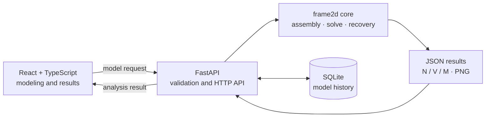

<div align="center">

# Frame Studio / frame2d

**Build, solve, and inspect 2D frame models in the browser.**

React workbench · FastAPI service · Python finite-element core

[简体中文](README.md) · [繁體中文](README.zh-TW.md) · [English](README.en.md)

</div>


`frame2d` is a linear-static finite-element solver for two-dimensional frames. It combines a visual React workbench, a FastAPI HTTP service, and an importable Python library to cover the complete workflow from model creation to displacement, reaction, axial-force, shear-force, and bending-moment results.

## Highlights

- Create, select, and drag nodes and members on an SVG canvas
- Manage materials, sections, supports, nodal loads, and linearly varying distributed loads
- Use three degrees of freedom per node: `[u, v, φ]`
- Define support-local axes at any angle and prescribe nonzero nodal displacements
- Solve nodal displacements, reactions, and local element end forces
- Recover displacement, deformed coordinates, and `N / V / M` fields along each element
- Inspect structural result diagrams in the UI and generate shear/moment PNG plots
- Validate global residuals, stiffness symmetry, and element equilibrium
- Store recent models in SQLite and import/export models as JSON
- Explore the API through generated Swagger UI and OpenAPI documentation

## Architecture



## Quick start

### Requirements

- Python `3.11+`
- Node.js `^20.19.0` or `>=22.12.0`
- npm

### Install

```bash
python3 -m venv .venv
source .venv/bin/activate
python -m pip install --upgrade pip
python -m pip install -e ".[test]"
npm --prefix frontend install
```

On Windows PowerShell, activate the environment with:

```powershell
.venv\Scripts\Activate.ps1
```

### Start the frontend and API together

```bash
npm run dev
```

| Service | URL |
| --- | --- |
| Frame Studio | <http://127.0.0.1:5173> |
| Swagger UI | <http://127.0.0.1:8000/docs> |
| Health check | <http://127.0.0.1:8000/health> |

Press `Ctrl+C` to stop both processes. Frontend hot module replacement is enabled by default. To reload the Python backend when source files change:

```bash
FRAME2D_API_RELOAD=1 npm run dev
```

Common environment variables:

| Variable | Default | Purpose |
| --- | --- | --- |
| `FRAME2D_HOST` | `127.0.0.1` | Frontend and API bind address |
| `FRAME2D_API_PORT` | `8000` | API port |
| `FRAME2D_FRONTEND_PORT` | `5173` | Frontend port |
| `FRAME2D_DB_PATH` | `data/frame2d.sqlite3` | SQLite database path |
| `FRAME2D_API_RELOAD` | `0` | Set to `1` for backend reloads |

### Start services separately

Backend only:

```bash
uvicorn frame2d.api:app --host 0.0.0.0 --port 8000 --reload
```

After installation, `frame2d-api` provides the same entry point. Frontend only:

```bash
npm --prefix frontend run dev
```

For split deployments, set `VITE_API_BASE_URL` to the API origin used by the browser. The development proxy target can be changed with `FRAME2D_API_URL`.

## Workflow

1. Use the left tool rail to create nodes, materials, sections, and elements.
2. Add supports, nodal loads, or element distributed loads.
3. Select **Run Analysis**.
4. Switch between displacement, reaction, axial, shear, and bending-moment results.
5. Use **Save / Open** to export or reload a JSON model.

New elements do not receive a material or section automatically. If an assignment is missing, the workbench selects the affected member and guides you to the required library before saving or solving.

## API

| Method | Path | Description |
| --- | --- | --- |
| `GET` | `/health` | Service health |
| `POST` | `/api/v1/solve` | Solve a model; optionally embed V/M PNGs |
| `POST` | `/api/v1/plots/shear-force` | Return a shear-force `image/png` |
| `POST` | `/api/v1/plots/bending-moment` | Return a bending-moment `image/png` |
| `GET` | `/api/v1/models` | List recent models |
| `POST` | `/api/v1/models` | Save a model |
| `DELETE` | `/api/v1/models/{id}` | Delete one model-history entry |
| `DELETE` | `/api/v1/models` | Clear model history |

The repository includes a [cantilever request example](examples/cantilever_request.json):

```bash
curl -X POST http://127.0.0.1:8000/api/v1/solve \
  -H "Content-Type: application/json" \
  --data-binary @examples/cantilever_request.json \
  --output result.json
```

Core request shape:

```json
{
  "nodes": [{"id": 1, "x": 0.0, "y": 0.0}],
  "elements": [],
  "supports": [],
  "nodal_loads": [],
  "distributed_loads": [],
  "number_of_points": 101,
  "deformation_scale": 1.0,
  "include_plots": true,
  "plot_dpi": 140
}
```

Key response fields:

- `nodal_displacements`: `u / v / phi` for each node
- `nodal_reactions`: global `fx / fy / mz`, grouped by node
- `elements[].local_end_forces`: `[fx_i, fy_i, m_i, fx_j, fy_j, m_j]`
- `elements[].fields`: sampled displacement, deformed coordinates, and `N / V / M`
- `validation`: stiffness-symmetry and free-direction residual checks
- `plots`: Base64 PNG data URIs that can be assigned directly to ``

Duplicate IDs, invalid references, zero-length elements, conflicting prescribed displacements, and unstable models return HTTP `422`; the reason is reported in `detail`.

## Python library

```python
from frame2d import FrameElement, NodalLoad, Node, Support, solve_frame

result = solve_frame(
    nodes=[Node(1, 0.0, 0.0), Node(2, 2.0, 0.0)],
    elements=[FrameElement(1, 1, 2, E=210e9, A=3e-3, I=8e-6)],
    supports=[Support(1, u=True, v=True, phi=True)],
    nodal_loads=[NodalLoad(2, fy=-10_000.0)],
)

print(result.nodal_displacements)
print(result.elements[0].fields.bending_moment)
```

## Units and sign conventions

Inputs and outputs must use one consistent unit system. The examples use SI units:

| Quantity | Unit |
| --- | --- |
| Length and displacement | `m` |
| Rotation | `rad` |
| Elastic modulus | `Pa` |
| Section area / second moment of area | `m²` / `m⁴` |
| Force, axial force, and shear | `N` |
| Moment and bending moment | `N·m` |
| Distributed load | `N/m` |

Positive nodal loads follow global `+X / +Y`, and positive nodal moments are counterclockwise. Distributed-load components follow element-local `+x / +y`. Axial force `N` is positive in tension. See the [finite-element mathematical basis](Math%20Logic/2D_Frame_%E6%9C%89%E9%99%90%E5%85%83%E7%B4%A0%E6%95%B8%E5%AD%B8%E4%BE%9D%E6%93%9A.md) for the full derivation.

## Project layout

```text
frontend/          React + TypeScript + Vite workbench
src/frame2d/       finite-element core, FastAPI app, and plotting
tests/             numerical, API, and plotting tests
examples/          JSON and Python examples
Math Logic/        derivations and reference material
data/              local SQLite model history
scripts/dev.mjs    combined development launcher
```

## Verify and build

```bash
pytest
npm run typecheck
npm run build
```

The test suite covers element stiffness, coordinate transforms, global assembly, load handling, boundary conditions, result recovery, plotting, model history, and API error handling.
