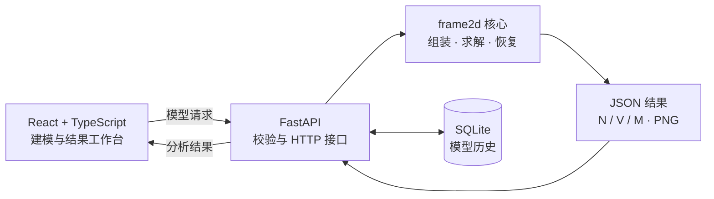

<div align="center">

# Frame Studio / frame2d

**在浏览器中建立、分析并检查二维刚架模型。**

React 工作台 · FastAPI 服务 · Python 有限元核心

[简体中文](README.md) · [繁體中文](README.zh-TW.md) · [English](README.en.md)

</div>


`frame2d` 是一个二维刚架线性静力有限元求解器。项目同时提供可视化 React 工作台、FastAPI HTTP API 和可直接导入的 Python 库，可从建模一路完成位移、反力、轴力、剪力与弯矩分析。

## 主要功能

- 在 SVG 画布中创建、选择、拖动节点与构件
- 管理材料、截面、支座、节点荷载与线性分布荷载
- 每个节点采用 `[u, v, φ]` 三个自由度
- 支持任意角度的支座局部轴与非零指定节点位移
- 求解节点位移、节点反力及单元局部端力
- 沿单元恢复位移、变形坐标及 `N / V / M` 场
- 在前端查看结构式结果，并输出剪力图、弯矩图 PNG
- 校验全局残差、刚度对称性与单元平衡
- 使用 SQLite 保存最近模型，支持 JSON 导入与导出
- 自动提供 Swagger UI 与 OpenAPI 文档

## 系统架构



## 快速开始

### 环境要求

- Python `3.11+`
- Node.js `^20.19.0` 或 `>=22.12.0`
- npm

### 安装

```bash
python3 -m venv .venv
source .venv/bin/activate
python -m pip install --upgrade pip
python -m pip install -e ".[test]"
npm --prefix frontend install
```

Windows PowerShell 请将激活命令替换为：

```powershell
.venv\Scripts\Activate.ps1
```

### 同时启动前端与后端

```bash
npm run dev
```

| 服务 | 地址 |
| --- | --- |
| Frame Studio | <http://127.0.0.1:5173> |
| Swagger UI | <http://127.0.0.1:8000/docs> |
| 健康检查 | <http://127.0.0.1:8000/health> |

在终端按 `Ctrl+C` 会同时停止两个服务。前端默认启用热更新；如需同时监听 Python 代码变化：

```bash
FRAME2D_API_RELOAD=1 npm run dev
```

常用环境变量：

| 变量 | 默认值 | 用途 |
| --- | --- | --- |
| `FRAME2D_HOST` | `127.0.0.1` | 前后端监听地址 |
| `FRAME2D_API_PORT` | `8000` | API 端口 |
| `FRAME2D_FRONTEND_PORT` | `5173` | 前端端口 |
| `FRAME2D_DB_PATH` | `data/frame2d.sqlite3` | 相对于程序目录的 SQLite 文件位置；移动程序文件夹时会一起移动 |
| `FRAME2D_API_RELOAD` | `0` | 设为 `1` 启用后端热更新 |

### 单独启动服务

仅启动后端：

```bash
uvicorn frame2d.api:app --host 0.0.0.0 --port 8000 --reload
```

安装项目后也可执行 `frame2d-api`。仅启动前端：

```bash
npm --prefix frontend run dev
```

部署或前后端分离运行时，可通过 `VITE_API_BASE_URL` 指定浏览器访问的 API origin；开发代理目标可通过 `FRAME2D_API_URL` 设置。

## 使用流程

1. 使用左侧工具栏建立节点、材料、截面与构件。
2. 添加支座、节点荷载或单元分布荷载。
3. 点击 **Run Analysis**。
4. 在结果区域切换位移、反力、轴力、剪力与弯矩。
5. 使用 **Save / Open** 导出或重新载入 JSON 模型。

新构件默认不带材料与截面。分析或保存前如有遗漏，工作台会定位到对应构件并引导完成指派。

## API

| 方法 | 路径 | 说明 |
| --- | --- | --- |
| `GET` | `/health` | 服务健康状态 |
| `POST` | `/api/v1/solve` | 求解模型；可选内嵌 V、M PNG |
| `POST` | `/api/v1/plots/shear-force` | 返回剪力图 `image/png` |
| `POST` | `/api/v1/plots/bending-moment` | 返回弯矩图 `image/png` |
| `GET` | `/api/v1/models` | 读取最近模型 |
| `POST` | `/api/v1/models` | 保存模型 |
| `DELETE` | `/api/v1/models/{id}` | 删除一个历史模型 |
| `DELETE` | `/api/v1/models` | 清空历史模型 |

仓库提供了[悬臂梁请求示例](examples/cantilever_request.json)：

```bash
curl -X POST http://127.0.0.1:8000/api/v1/solve \
  -H "Content-Type: application/json" \
  --data-binary @examples/cantilever_request.json \
  --output result.json
```

请求的核心结构如下：

```json
{
  "nodes": [{"id": 1, "x": 0.0, "y": 0.0}],
  "elements": [],
  "supports": [],
  "nodal_loads": [],
  "distributed_loads": [],
  "number_of_points": 101,
  "deformation_scale": 1.0,
  "include_plots": true,
  "plot_dpi": 140
}
```

主要结果包括：

- `nodal_displacements`：每个节点的 `u / v / phi`
- `nodal_reactions`：按节点整理的全局 `fx / fy / mz`
- `elements[].local_end_forces`：`[fx_i, fy_i, m_i, fx_j, fy_j, m_j]`
- `elements[].fields`：沿单元采样的位移、变形坐标和 `N / V / M`
- `validation`：刚度对称性与自由方向残差检查
- `plots`：可直接赋给 `` 的 Base64 PNG data URI

重复编号、无效引用、零长度单元、冲突位移或不稳定模型会返回 HTTP `422`，原因位于 `detail` 字段。

## 作为 Python 库使用

```python
from frame2d import FrameElement, NodalLoad, Node, Support, solve_frame

result = solve_frame(
    nodes=[Node(1, 0.0, 0.0), Node(2, 2.0, 0.0)],
    elements=[FrameElement(1, 1, 2, E=210e9, A=3e-3, I=8e-6)],
    supports=[Support(1, u=True, v=True, phi=True)],
    nodal_loads=[NodalLoad(2, fy=-10_000.0)],
)

print(result.nodal_displacements)
print(result.elements[0].fields.bending_moment)
```

## 单位与符号

所有输入和输出必须采用一致的单位制。项目示例使用 SI：

| 物理量 | 单位 |
| --- | --- |
| 长度、位移 | `m` |
| 转角 | `rad` |
| 弹性模量 | `Pa` |
| 截面面积 / 惯性矩 | `m²` / `m⁴` |
| 力、轴力、剪力 | `N` |
| 力矩、弯矩 | `N·m` |
| 分布荷载 | `N/m` |

节点荷载正方向为全局 `+X / +Y`，正力矩为逆时针；分布荷载沿单元局部 `+x / +y`。轴力 `N` 以受拉为正。更完整的推导见[有限元数学依据](Math%20Logic/2D_Frame_%E6%9C%89%E9%99%90%E5%85%83%E7%B4%A0%E6%95%B8%E5%AD%B8%E4%BE%9D%E6%93%9A.md)。

## 项目结构

```text
frontend/          React + TypeScript + Vite 工作台
src/frame2d/       有限元核心、FastAPI 与绘图
tests/             数值、API 与绘图测试
examples/          JSON 与 Python 示例
Math Logic/        数学推导与参考资料
data/              本地 SQLite 模型历史
scripts/dev.mjs    前后端统一开发启动器
```

## 验证与构建

```bash
pytest
npm run typecheck
npm run build
```

测试覆盖单元刚度、坐标变换、全局组装、荷载处理、边界条件、结果恢复、绘图、历史模型与 API 错误处理。
