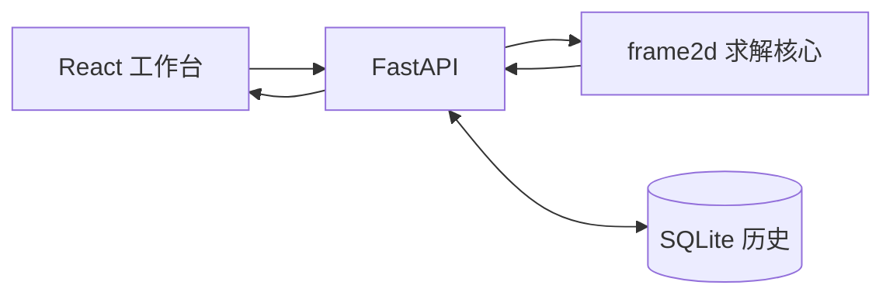

<div align="center">

# Frame Studio / frame2d

**在浏览器里直接画刚架、跑分析、看 N / V / M 图。**

React 工作台 · FastAPI · Python 有限元核心

[English](README.md) · [简体中文](README.zh-CN.md) · [繁體中文](README.zh-TW.md)

<br/>


<sub>打开即用：画布建模 · 材料 / 截面库 · 结果表与结构图</sub>

</div>

---

## 60 秒上手

**环境：** Python `3.11+` · Node.js `20.19+` 或 `22.12+` · npm

```bash
# 1. 克隆并进入项目
git clone <your-repo-url> 2D-Frame-Project
cd 2D-Frame-Project

# 2. Python 环境 + 安装求解器
python3 -m venv .venv
source .venv/bin/activate          # Windows: .venv\Scripts\Activate.ps1
python -m pip install --upgrade pip
python -m pip install -e ".[test]"

# 3. 前端依赖
npm --prefix frontend install

# 4. 一条命令同时启动前端 + API
npm run dev
```

浏览器打开：

| 服务 | 地址 |
| --- | --- |
| **Frame Studio 工作台** | http://127.0.0.1:5173 |
| Swagger API 文档 | http://127.0.0.1:8000/docs |
| 健康检查 | http://127.0.0.1:8000/health |

终端里按 `Ctrl+C` 会同时停掉前后端。

> **第一次打开会看到什么？**  
> 内置示例 **Portal frame 01**（门式刚架 + 均布荷载）。点右上角 **Run Analysis**，底部 Results 即可切换位移、反力、轴力、剪力、弯矩。

---

## 产品一览

### 建模工作台

左侧工具栏按工作流排列：节点 → 材料 → 截面 → 构件 → 支座 → 荷载。  
属性面板编辑参数，画布上直接点选、拖动、缩放。

<p align="center">
  
</p>

### 剪力 / 弯矩结果

分析完成后，Results 区可展开结构图，并按单元查看端点值与包络。

<p align="center">
  
</p>

<p align="center">
  
</p>

---

## 你能做什么

| 能力 | 说明 |
| --- | --- |
| 可视化建模 | SVG 画布创建节点 / 构件；支持坐标输入、构件上插点拆分 |
| 材料与截面库 | 下拉管理、指派到单元；**More details** 在画布上查看分配 |
| 支座与荷载 | 固定 / 铰支 / 滚轴预设；节点力矩与分布荷载 |
| 一键分析 | 线性静力求解：位移、反力、`N / V / M` 场 |
| 结果检查 | 结构图 + 表格；校验残差与刚度对称性 |
| 模型历史 | SQLite 最近模型 + 示例模型浏览器 |
| 接口与脚本 | REST API、Swagger、可 import 的 `frame2d` 库 |

---

## 典型操作路径

1. **Node** — 点击画布或在属性里输入 `X / Y` 放点  
2. **Material / Section** — 定义 `E`、`A`、`I`，Apply 到构件  
3. **Element** — 点两个节点连梁柱；需要时可在构件上按比例 / 距离拆分  
4. **Support / Load** — 加支座与荷载  
5. **Run Analysis** — 查看位移、反力、剪力、弯矩  
6. **Save / Models** — 导出 JSON，或从历史 / 示例恢复  

新建构件默认未分配材料与截面；保存或分析前若有遗漏，工作台会跳到对应构件并提示指派。

---

## 架构（简图）



---

## 常用命令

```bash
npm run dev                 # 开发：前端 + API
FRAME2D_API_RELOAD=1 npm run dev   # 后端也热更新

pytest                      # 数值 / API 测试
npm run typecheck           # 前端类型检查
npm run build               # 前端生产构建
```

| 环境变量 | 默认 | 用途 |
| --- | --- | --- |
| `FRAME2D_HOST` | `127.0.0.1` | 监听地址 |
| `FRAME2D_API_PORT` | `8000` | API 端口 |
| `FRAME2D_FRONTEND_PORT` | `5173` | 前端端口 |
| `FRAME2D_DB_PATH` | `data/frame2d.sqlite3` | 模型历史库 |
| `FRAME2D_API_RELOAD` | `0` | `1` = 后端热重载 |

单独起服务：

```bash
# 仅 API
uvicorn frame2d.api:app --host 0.0.0.0 --port 8000 --reload

# 仅前端
npm --prefix frontend run dev
```

---

## API 速查

| 方法 | 路径 | 说明 |
| --- | --- | --- |
| `GET` | `/health` | 健康检查 |
| `POST` | `/api/v1/solve` | 求解（可选嵌入 V/M 图） |
| `POST` | `/api/v1/plots/shear-force` | 剪力图 PNG |
| `POST` | `/api/v1/plots/bending-moment` | 弯矩图 PNG |
| `GET/POST/DELETE` | `/api/v1/models` | 模型历史 |

示例请求（仓库内置悬臂梁）：

```bash
curl -X POST http://127.0.0.1:8000/api/v1/solve \
  -H "Content-Type: application/json" \
  --data-binary @examples/cantilever_request.json \
  --output result.json
```

---

## 作为 Python 库

```python
from frame2d import FrameElement, NodalLoad, Node, Support, solve_frame

result = solve_frame(
    nodes=[Node(1, 0.0, 0.0), Node(2, 2.0, 0.0)],
    elements=[FrameElement(1, 1, 2, E=210e9, A=3e-3, I=8e-6)],
    supports=[Support(1, u=True, v=True, phi=True)],
    nodal_loads=[NodalLoad(2, fy=-10_000.0)],
)

print(result.nodal_displacements)
print(result.elements[0].fields.bending_moment)
```

---

## 单位（SI 示例）

| 量 | 单位 | 量 | 单位 |
| --- | --- | --- | --- |
| 长度 / 位移 | `m` | 弹性模量 | `Pa` |
| 转角 | `rad` | 面积 / 惯性矩 | `m²` / `m⁴` |
| 力 / 轴力 / 剪力 | `N` | 力矩 / 弯矩 | `N·m` |
| 分布荷载 | `N/m` | | |

节点荷载沿全局 `+X / +Y`，正力矩逆时针；分布荷载沿单元局部轴。轴力以受拉为正。  
完整推导见 [有限元数学依据](Math%20Logic/2D_Frame_%E6%9C%89%E9%99%90%E5%85%83%E7%B4%A0%E6%95%B8%E5%AD%B8%E4%BE%9D%E6%93%9A.md)。

---

## 目录结构

```text
photo/             界面截图（README 用）
frontend/          React + TypeScript + Vite 工作台
src/frame2d/       有限元核心、API、绘图
tests/             数值与 API 测试
examples/          JSON / Python 示例
Math Logic/        数学推导与参考
data/              本地 SQLite 模型历史
scripts/dev.mjs    前后端一键启动
```

---

## 许可证与贡献

欢迎 Issue / PR。提交前建议：

```bash
pytest && npm run typecheck
```
