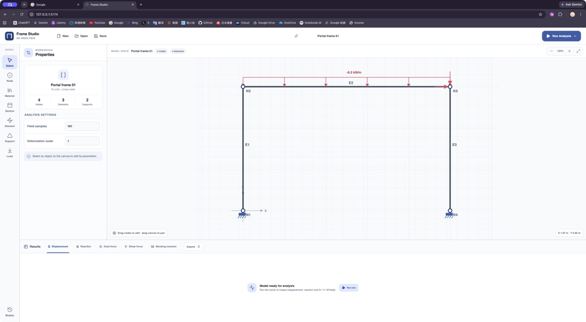
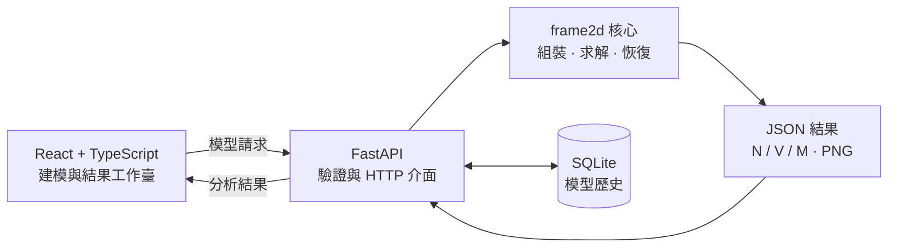

<div align="center">

# Frame Studio / frame2d

**在瀏覽器中建立、分析並檢查二維剛架模型。**

React 工作臺 · FastAPI 服務 · Python 有限元素核心

[简体中文](README.md) · [繁體中文](README.zh-TW.md) · [English](README.en.md)

</div>



`frame2d` 是一套二維剛架線性靜力有限元素求解器。專案同時提供視覺化 React 工作臺、FastAPI HTTP API 與可直接匯入的 Python 函式庫，可從建模一路完成位移、反力、軸力、剪力與彎矩分析。

## 主要功能

- 在 SVG 畫布中建立、選取、拖曳節點與構件
- 管理材料、斷面、支承、節點荷載與線性分佈荷載
- 每個節點採用 `[u, v, φ]` 三個自由度
- 支援任意角度的支承局部軸與非零指定節點位移
- 求解節點位移、節點反力及元素局部端力
- 沿元素恢復位移、變形座標及 `N / V / M` 場
- 在前端查看結構式結果，並輸出剪力圖、彎矩圖 PNG
- 驗證全域殘差、勁度對稱性與元素平衡
- 使用 SQLite 儲存最近模型，支援 JSON 匯入與匯出
- 自動提供 Swagger UI 與 OpenAPI 文件

## 系統架構



## 快速開始

### 環境需求

- Python `3.11+`
- Node.js `^20.19.0` 或 `>=22.12.0`
- npm

### 安裝

```bash
python3 -m venv .venv
source .venv/bin/activate
python -m pip install --upgrade pip
python -m pip install -e ".[test]"
npm --prefix frontend install
```

Windows PowerShell 請將啟用指令替換為：

```powershell
.venv\Scripts\Activate.ps1
```

### 同時啟動前端與後端

```bash
npm run dev
```

| 服務 | 位址 |
| --- | --- |
| Frame Studio | <http://127.0.0.1:5173> |
| Swagger UI | <http://127.0.0.1:8000/docs> |
| 健康檢查 | <http://127.0.0.1:8000/health> |

在終端按 `Ctrl+C` 會同時停止兩項服務。前端預設啟用熱更新；若需同時監聽 Python 程式碼變更：

```bash
FRAME2D_API_RELOAD=1 npm run dev
```

常用環境變數：

| 變數 | 預設值 | 用途 |
| --- | --- | --- |
| `FRAME2D_HOST` | `127.0.0.1` | 前後端監聽位址 |
| `FRAME2D_API_PORT` | `8000` | API 連接埠 |
| `FRAME2D_FRONTEND_PORT` | `5173` | 前端連接埠 |
| `FRAME2D_DB_PATH` | `data/frame2d.sqlite3` | SQLite 檔案位置 |
| `FRAME2D_API_RELOAD` | `0` | 設為 `1` 啟用後端熱更新 |

### 單獨啟動服務

僅啟動後端：

```bash
uvicorn frame2d.api:app --host 0.0.0.0 --port 8000 --reload
```

安裝專案後也可執行 `frame2d-api`。僅啟動前端：

```bash
npm --prefix frontend run dev
```

部署或前後端分離執行時，可透過 `VITE_API_BASE_URL` 指定瀏覽器存取的 API origin；開發代理目標可透過 `FRAME2D_API_URL` 設定。

## 使用流程

1. 使用左側工具列建立節點、材料、斷面與構件。
2. 加入支承、節點荷載或元素分佈荷載。
3. 點選 **Run Analysis**。
4. 在結果區域切換位移、反力、軸力、剪力與彎矩。
5. 使用 **Save / Open** 匯出或重新載入 JSON 模型。

新構件預設不包含材料與斷面。分析或儲存前若有遺漏，工作臺會定位至對應構件並引導完成指派。

## API

| 方法 | 路徑 | 說明 |
| --- | --- | --- |
| `GET` | `/health` | 服務健康狀態 |
| `POST` | `/api/v1/solve` | 求解模型；可選擇內嵌 V、M PNG |
| `POST` | `/api/v1/plots/shear-force` | 回傳剪力圖 `image/png` |
| `POST` | `/api/v1/plots/bending-moment` | 回傳彎矩圖 `image/png` |
| `GET` | `/api/v1/models` | 讀取最近模型 |
| `POST` | `/api/v1/models` | 儲存模型 |
| `DELETE` | `/api/v1/models/{id}` | 刪除一個歷史模型 |
| `DELETE` | `/api/v1/models` | 清空歷史模型 |

儲存庫提供了[懸臂梁請求範例](examples/cantilever_request.json)：

```bash
curl -X POST http://127.0.0.1:8000/api/v1/solve \
  -H "Content-Type: application/json" \
  --data-binary @examples/cantilever_request.json \
  --output result.json
```

請求的核心結構如下：

```json
{
  "nodes": [{"id": 1, "x": 0.0, "y": 0.0}],
  "elements": [],
  "supports": [],
  "nodal_loads": [],
  "distributed_loads": [],
  "number_of_points": 101,
  "deformation_scale": 1.0,
  "include_plots": true,
  "plot_dpi": 140
}
```

主要結果包括：

- `nodal_displacements`：每個節點的 `u / v / phi`
- `nodal_reactions`：依節點整理的全域 `fx / fy / mz`
- `elements[].local_end_forces`：`[fx_i, fy_i, m_i, fx_j, fy_j, m_j]`
- `elements[].fields`：沿元素取樣的位移、變形座標和 `N / V / M`
- `validation`：勁度對稱性與自由方向殘差檢查
- `plots`：可直接指定給 `` 的 Base64 PNG data URI

重複編號、無效參照、零長度元素、衝突位移或不穩定模型會回傳 HTTP `422`，原因位於 `detail` 欄位。

## 作為 Python 函式庫使用

```python
from frame2d import FrameElement, NodalLoad, Node, Support, solve_frame

result = solve_frame(
    nodes=[Node(1, 0.0, 0.0), Node(2, 2.0, 0.0)],
    elements=[FrameElement(1, 1, 2, E=210e9, A=3e-3, I=8e-6)],
    supports=[Support(1, u=True, v=True, phi=True)],
    nodal_loads=[NodalLoad(2, fy=-10_000.0)],
)

print(result.nodal_displacements)
print(result.elements[0].fields.bending_moment)
```

## 單位與符號

所有輸入與輸出必須採用一致的單位制。專案範例使用 SI：

| 物理量 | 單位 |
| --- | --- |
| 長度、位移 | `m` |
| 轉角 | `rad` |
| 彈性模數 | `Pa` |
| 斷面面積 / 慣性矩 | `m²` / `m⁴` |
| 力、軸力、剪力 | `N` |
| 力矩、彎矩 | `N·m` |
| 分佈荷載 | `N/m` |

節點荷載正方向為全域 `+X / +Y`，正力矩為逆時針；分佈荷載沿元素局部 `+x / +y`。軸力 `N` 以受拉為正。更完整的推導請見[有限元素數學依據](Math%20Logic/2D_Frame_%E6%9C%89%E9%99%90%E5%85%83%E7%B4%A0%E6%95%B8%E5%AD%B8%E4%BE%9D%E6%93%9A.md)。

## 專案結構

```text
frontend/          React + TypeScript + Vite 工作臺
src/frame2d/       有限元素核心、FastAPI 與繪圖
tests/             數值、API 與繪圖測試
examples/          JSON 與 Python 範例
Math Logic/        數學推導與參考資料
data/              本機 SQLite 模型歷史
scripts/dev.mjs    前後端統一開發啟動器
```

## 驗證與建置

```bash
pytest
npm run typecheck
npm run build
```

測試涵蓋元素勁度、座標轉換、全域組裝、荷載處理、邊界條件、結果恢復、繪圖、歷史模型與 API 錯誤處理。
